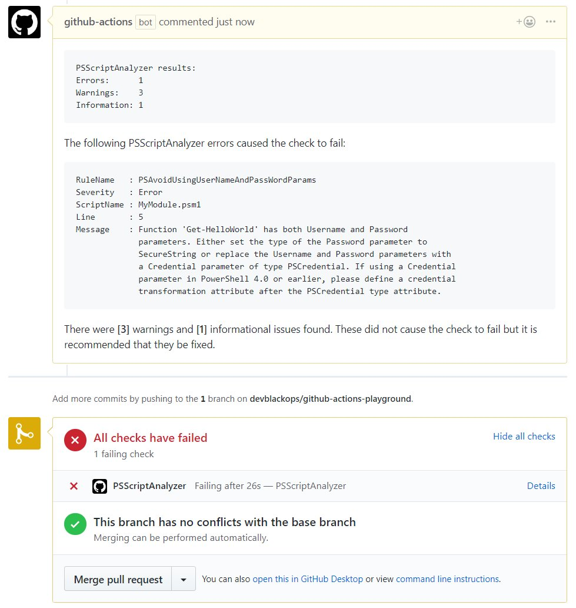

# github-action-psscriptanalyzer

[GitHub Action](https://github.com/features/actions) to run [PSScriptAnalyzer](https://github.com/PowerShell/PSScriptAnalyzer) static code analysis checks on [Pull Requests](https://help.github.com/articles/about-pull-requests/).

## Success Criteria

This action will succeed if **zero** PSScriptAnalyzer errors are found.
If any warnings or informational issues are found, a comment will be posted to the pull request but the action will not return a failure.

## Usage

Place the following in your `./github/main.workflow` file to run PSScriptAnalyzer on incoming pull requests.

> Make sure `secrets = ["GITHUB_TOKEN"]` is present as it is required to post a comment back to the pull request.

```hcl
workflow "psscriptanalysis" {
  on       = "pull_request"
  resolves = "PSScriptAnalyzer"
}

action "PSScriptAnalyzer" {
    # Replace <latest tag> with the latest tag from
    # https://github.com/devblackops/github-action-psscriptanalyzer/releases
    uses = "devblackops/github-action-psscriptanalyzer/analyze@<latest tag>"

    secrets = ["GITHUB_TOKEN"]

    # Optional environment variables to control analysis behavior
    env = {
        PSSCRIPTANALYZER_ROOT          = "./MyModule"
        PSSCRIPTANALYZER_SETTINGS_PATH = "./settings.psd1
    }
}
```

## Environment Variables

| Name | Default | Description |
|--------------------------------|------|-------------|
| PSSCRIPTANALYZER_ROOT          | .    | The root directory to run PSScriptAnalyzer on. By default, this is the root of the repository.
| PSSCRIPTANALYZER_SETTINGS_PATH | none | The path to a PSScriptAnalyser settings file to control rules to execute.
| PSSCRIPTANALYZER_SEND_COMMENT  | true | Enable/disable sending comments with PSScriptAnalyzer results back to PR.

## Example


